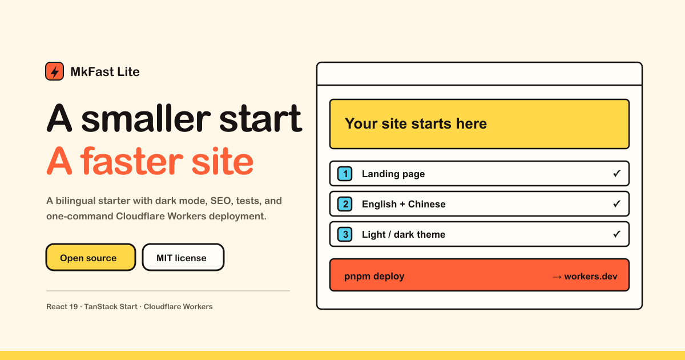

<h1 align="center">TanStarter Lite</h1>

<p align="center">
  A multilingual starter for a simple, fast public website.
</p>

<p align="center">
  <a href="./LICENSE"></a>
  <a href="https://react.dev"></a>
  <a href="https://workers.cloudflare.com"></a>
</p>

<p align="center">
  <a href="#getting-started">Quick Start</a> ·
  <a href="#customize-the-template">Customize</a> ·
  <a href="#deploy-to-cloudflare-workers">Deploy</a>
</p>

[](https://github.com/MkFastHQ/mkfast-lite)

TanStarter Lite is the lite version of TanStarter: an open-source, deliberately
small starter for a multilingual public website. It provides a complete
localized landing page, light/dark/system themes, SEO endpoints,
tests, and Cloudflare Workers deployment—without the operational surface of a
SaaS starter.

It intentionally does not include authentication, payments, persistence,
storage, cache, transactional email, newsletters, or an admin surface. Add
those only when they match the product you are building.

## Features

- **Multilingual by default** — English at `/` and Simplified Chinese at `/zh`,
  with typed Paraglide messages and a language menu that keeps the current
  section anchor.
- **A focused landing page** — responsive navigation, hero, stack,
  architecture, template, FAQ, and closing sections.
- **Theme choices** — light, dark, and system themes; the selection persists
  in local storage.
- **Search-ready public surface** — localized canonical and alternate links,
  Open Graph and Twitter metadata, JSON-LD, `robots.txt`, `sitemap.xml`, and
  `manifest.webmanifest`.
- **No required services** — the default Worker has no D1, R2, KV, or secret
  bindings and deploys to `workers.dev`.

## Tech stack

- [React 19](https://react.dev/) and [TypeScript](https://www.typescriptlang.org/)
- [TanStack Start](https://tanstack.com/start) and TanStack Router
- [Tailwind CSS](https://tailwindcss.com/)
- [Paraglide](https://inlang.com/m/gerre34r/library-inlang-paraglideJs) for
  type-safe localization
- [Cloudflare Workers](https://workers.cloudflare.com/) and
  [Wrangler](https://developers.cloudflare.com/workers/wrangler/)
- [Vitest](https://vitest.dev/) and [Playwright](https://playwright.dev/)

## Getting started

### Prerequisites

- [Node.js](https://nodejs.org/)
- [pnpm](https://pnpm.io/) 10.30.3 or later

### Run locally

```bash
git clone https://github.com/MkFastHQ/mkfast-lite.git
cd mkfast-lite
pnpm install
pnpm dev
```

Open `http://localhost:3000` for English or `http://localhost:3000/zh` for
Simplified Chinese.

## Common commands

| Command | Description |
| --- | --- |
| `pnpm dev` | Start the Vite development server on `127.0.0.1:3000` |
| `pnpm check` | Run Biome checks, locale parity checks, unit tests, and TypeScript |
| `pnpm test` | Run the Vitest unit suite |
| `pnpm build` | Create a production build and type-check it |
| `pnpm e2e` | Run Playwright desktop and mobile coverage |
| `pnpm locale:compile` | Regenerate the Paraglide runtime after locale edits |
| `pnpm locale:check` | Check English and Chinese message-key parity |
| `pnpm cf-typegen` | Regenerate Worker environment types after Wrangler changes |
| `pnpm deploy` | Build and deploy the Worker |

The end-to-end suite covers both locales, language switching, theme
persistence, responsive navigation, FAQ behavior, machine-readable SEO
endpoints, and the intentionally absent application routes.

## Customize the template

1. Update the site name, canonical URL, repository URL, default theme, and navigation in
   `src/config/website.ts`.
2. Edit English and Simplified Chinese copy in
   `project.inlang/messages/en.json` and `project.inlang/messages/zh.json`.
3. Replace `public/favicon.svg` and the Open Graph image in `public/`.
4. Reorder or remove homepage sections in
   `src/components/home/home-page.tsx`; adjust visual tokens in
   `src/styles.css` when needed.
5. Add routes under `src/routes/` with TanStack Router's file-route
   convention. Add matching English and `/zh` routes, localized metadata, and
   messages when a page needs localized content.

Locale JSON files are the source of truth. Never edit
`src/locale/paraglide/` by hand; regenerate it after changing copy:

```bash
pnpm locale:compile
pnpm locale:check
```

Generated `src/routeTree.gen.ts` and `worker-configuration.d.ts` follow the
same rule: regenerate them through the relevant tooling rather than editing
them directly.

The default routes are `/`, `/zh`, `/robots.txt`, `/sitemap.xml`, and
`/manifest.webmanifest`. Product routes such as login, pricing, dashboard,
and admin deliberately return 404 until you decide to add them.

Set `websiteConfig.url` to the production origin before launch. Until then,
canonical, alternate-language, and social metadata use the incoming request
origin so local development and deployment previews remain valid.

## Deploy to Cloudflare Workers

Authenticate Wrangler once, then deploy:

```bash
pnpm exec wrangler login
pnpm deploy
```

The committed `wrangler.jsonc` keeps `workers_dev` enabled and contains no
account ID, custom domain, resource bindings, or application secrets. The
first deployment publishes to your Cloudflare account's `workers.dev`
subdomain.

To attach a hostname without making it the template default:

```bash
pnpm exec wrangler deploy --domain your-site.example.com
```

Do not commit personal account IDs, tokens, or secrets to a project created
from this template.

## Project map

- `src/routes/` — pages, 404 handling, and machine-readable endpoints.
- `src/components/` — layout, language/theme controls, UI primitives, and
  landing-page sections.
- `src/config/` — product-owned site identity, repository link, and
  navigation.
- `src/lib/` — locale routing, SEO, and utility contracts.
- `src/styles.css` — shared theme tokens and global styles.
- `project.inlang/messages/` — authoritative English and Simplified Chinese
  copy.
- `scripts/` — locale validation.
- `tests/` — Vitest unit contracts and Playwright acceptance tests.
- `wrangler.jsonc` — the Workers entry point and committed deployment default.

## Contributing

Contributions are welcome. Fork the repository, make a focused change, update
tests and documentation when behavior changes, and run the relevant checks
before opening a pull request:

```bash
pnpm check
pnpm build
pnpm e2e
git diff --check
```

## Links

- [Repository](https://github.com/MkFastHQ/mkfast-lite) — source code and issue tracker.
- [TanStarter](https://tanstarter.dev) — a fuller TanStack and Cloudflare starter for SaaS products.
- [MkAgent](https://mkagent.app) — a local-first, Pi-powered AI agent workspace.

## Author

[OpenFox](https://mksaas.link/fox-x) is an independent developer building
products and developer tools. His products include:

- [MkAgent](https://mkagent.app) — A local-first, Pi-powered AI agent workspace for Desktop, WebUI, and CLI.
- [TanStarter](https://tanstarter.dev) — Ship Faster with TanStack, Cost Less with Cloudflare.
- [MkSaaS](https://mksaas.com) — Make Your AI SaaS Product in a Weekend.
- [MkImage](https://mkimage.ai) — Make Any Images Possible.
- [MkDirs](https://mkdirs.com) — Launch AI-powered directory in 30 minutes.
- [MkDollar](https://mkdollar.com) — The all-in-one platform to help you make first dollar online.

## License

Licensed under the [MIT License](./LICENSE).
